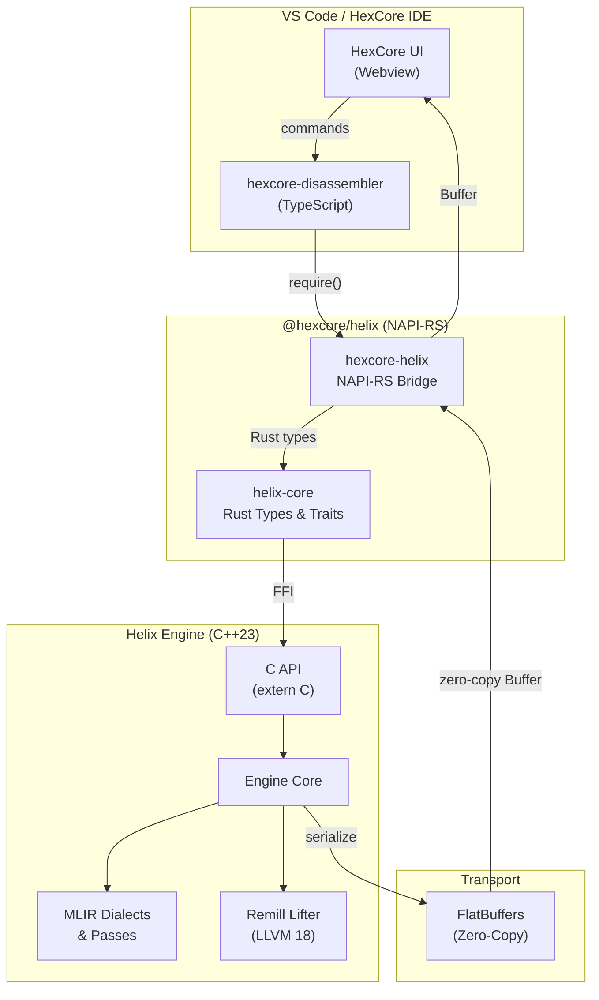

# HexCore Helix

> **Next-generation decompilation engine** — C++23/MLIR + Rust + FlatBuffers
>
> Turns machine code into readable pseudo-C, powered by custom MLIR dialects and real flag/condition recovery.

[](https://github.com/LXrdKnowkill/HexCore-Helix/actions/workflows/build.yml)

## Architecture



## Stack

| Layer | Technology | Purpose |
|---|---|---|
| **Lifting** | Remill (LLVM 18) | Machine code → LLVM IR |
| **Core Logic** | C++23 + MLIR | Custom dialects for progressive decompilation |
| **HIR Pipeline** | Rust (helix-core) | Calling convention, type propagation, control flow recovery |
| **Safety Bridge** | Rust + NAPI-RS | Memory-safe bridge to Node.js/VS Code |
| **Transport** | FlatBuffers | Zero-copy IPC between engine and UI |

## What's Working (March 2026)

### MLIR Decompilation Engine (Phase 2) ✅

The C++23 engine with custom MLIR dialects is now the **primary decompilation backend**:

- **7-pass MLIR pipeline** — RemillToHelixLow → RecoverStackLayout → RecoverCallingConvention → PropagateTypes → StructureControlFlow → RecoverVariables → EliminateDeadCode
- **170+ x86-64 semantics** — MOV, LEA, CMP, TEST, ADD, SUB, AND, OR, XOR, CMOV, XCHG, and more
- **Flag recovery** — `if (nz)` → `if (x != 0)`, flag synthesis from CMP/TEST results
- **Control flow structuring** — `if/else`, `while`, `do-while`, `goto/label`, ternary from CMOV
- **Argument recovery** — Tracks RCX, RDX, R8, R9 before `CALL` to populate function arguments
- **Vtable call naming** — `rax->vfunc_0x18()` from indirect call offsets
- **Standalone CLI** — `helix_tool.exe input.ll` produces clean pseudo-C
- **PseudoCEmitter** — 2300+ lines of expression formatting, dead store suppression, confidence scoring
- Real-world testing on **Saber Interactive** (World War Z) and **Crystal Dynamics** (ROTTR) game binaries

### HIR Pipeline (Phase 1.5) ✅

The Rust-based HIR pipeline serves as the secondary decompilation path for simpler functions:

- **HIR Builder & Emitter** — Lowering from Remill IR to pseudo-C with named variables
- **Calling Convention Recovery** — Win64 argument folding, result naming
- **Type Propagation** — Iterative refinement of `Unknown` types to fixed-point
- **Control Flow Structuring** — Recovery of `if/else` and `while` from CMP/TEST + Jcc
- **Data Flow Analysis** — Liveness, reaching definitions, dead code elimination
- **104 unit tests passing**, throughput **>95 instr/ms**

### FlatBuffers Transport (Phase 3) ✅

Zero-copy binary transport between the engine and the VS Code UI:

- **Schemas** — `common.fbs`, `cfg.fbs` (file ID `HCFG`), `ast.fbs` (file ID `HAST`)
- **Rust serialization** — Manual FlatBuffer builder with roundtrip tests
- **NAPI zero-copy** — `Buffer` objects passed directly to TypeScript without copying

## Test Data

The `tests/` directory contains real-world decompilation outputs from **Rise of the Tomb Raider** (`ROTTR.exe`) and **World War Z** (`wwzRetailEgs.exe`):

```
tests/
├── remill-7/          # Saber Interactive engine (multi-block, 49 blocks)
│   ├── bone_pos_calc3.ll       # Bone position calculation (complex)
│   ├── bone_pos_calc3.helix.c  # Helix decompiled output
│   └── projectile_constructor.ll
└── reports/
    ├── latest.md             # Current benchmark results
    ├── helix-vs-rellic.md    # Side-by-side comparison metrics
    └── flatbuf-vs-json.md    # FlatBuffers vs JSON benchmark
```

Each test case contains:
- `*.ll` — Remill-lifted LLVM IR
- `*.helix.c` — Helix decompiled output

### Benchmark Highlights (ROTTR.exe)

| Sample | Functions | Instructions | Throughput | Mean |
|---|---|---|---|---|
| Sample A (calls + register moves) | 3 | 52 | 95.44 instr/ms | 0.545ms |
| Sample B (LEA + memory stores) | 6 | 48 | 79.92 instr/ms | 0.601ms |
| Sample C (branch-heavy) | 2 | 65 | 99.37 instr/ms | 0.654ms |

## Project Structure

```
HexCore-Helix/
├── Cargo.toml                    # Rust workspace root
├── CHANGELOG.md                  # Version history
├── engine/                       # C++23 MLIR Engine (Phase 2)
│   ├── CMakeLists.txt            # CMake build (C++23, LLVM 18, MLIR)
│   ├── dialects/
│   │   ├── HelixLowOps.td        # HelixLow dialect (TableGen)
│   │   └── HelixHighOps.td       # HelixHigh dialect (TableGen)
│   ├── include/helix/
│   │   ├── Engine.h              # Engine class + C API
│   │   ├── passes/Passes.h       # Pass registration
│   │   └── emit/PseudoCEmitter.h # Emitter header
│   ├── src/
│   │   ├── Pipeline.cpp          # 7-pass MLIR pipeline orchestration
│   │   ├── passes/
│   │   │   ├── RemillToHelixLow.cpp       # Remill IR → HelixLow
│   │   │   ├── StructureControlFlow.cpp   # CFG → if/while/goto
│   │   │   ├── RecoverVariables.cpp       # Register → variable
│   │   │   ├── EliminateDeadCode.cpp      # Dead store elimination
│   │   │   ├── PropagateTypes.cpp         # Type inference
│   │   │   └── RecoverStackLayout.cpp     # Stack frame analysis
│   │   └── emit/
│   │       └── PseudoCEmitter.cpp         # MLIR → pseudo-C (2300 lines)
│   └── tools/
│       └── helix_tool.cpp        # Standalone CLI decompiler
├── crates/
│   ├── helix-core/               # Rust library (HIR pipeline, Phase 1.5)
│   └── hexcore-helix/            # NAPI-RS bridge (Node.js ↔ Rust)
├── schemas/                      # FlatBuffers schemas (CFG, AST)
├── tests/                        # Real-world test cases
│   └── remill-7/                 # Saber Interactive engine samples
└── .github/workflows/
    └── build.yml                 # CI/CD pipeline
```

## Quick Start

### Prerequisites

- **Rust** (stable, via `rustup`)
- **Node.js** ≥ 22
- **CMake** ≥ 3.20
- **C++23 compiler** (MSVC 2022, GCC 13+, or Clang 16+)

### Foundation Baseline (2026)

- **Node runtime policy**: Node 22+ only (avoid EOL runtime drift).
- **NAPI-RS**: `napi` 3.x + `napi-derive` 3.x.
- **Transport**: FlatBuffers 25.x runtime.
- **ABI guardrails**: `helix-core` includes explicit contract tests for `ArchKind` and `HelixStatus`.

### Build

```bash
# Build C++ MLIR engine
cmake -B engine/build -S engine -DCMAKE_BUILD_TYPE=Release
cmake --build engine/build --config Release

# Decompile a single file
./engine/build/helix_tool.exe tests/remill-7/bone_pos_calc3.ll

# Batch decompile a folder
./engine/build/helix_tool.exe --dir tests/remill-7/

# Build Rust components (optional)
cargo build --workspace
cargo test --workspace
```

### Optional: Signature DB (CRT/Win32 naming)

Helix can rename recovered call targets from a CSV address database:

```csv
# signatures/windows_crt_win32.csv
0x140123456,CreateFileW,HANDLE
0x140123500,CloseHandle,BOOL
0x140123980,memcpy,void*
```

Lookup order:
- `signatures/windows_crt_win32.csv`
- `signatures/signatures.csv`
- `signatures.csv`

### Usage (TypeScript)

```typescript
import { HelixEngine, Architecture } from '@hexcore/helix';

const engine = new HelixEngine(Architecture.X86_64);
const binary = fs.readFileSync('target.exe');

const result = engine.decompile(binary, 0x400000n, 0x401000n);
console.log(result.source);
console.log(`Blocks: ${result.blockCount}, Instructions: ${result.instructionCount}`);

engine.dispose();
```

## Roadmap

- [x] **Phase 1**: Foundation & Safety Bridge (Rust + NAPI-RS + C++ scaffold)
- [x] **Phase 1.5**: HIR Pipeline & Robustness (104 tests, >95 instr/ms)
- [x] **Phase 2**: MLIR Engine — Custom dialects, 7-pass pipeline, PseudoCEmitter, CLI tool
- [x] **Phase 3**: FlatBuffers Transport (Zero-copy CFG/AST schemas + serialization)
- [ ] **Phase 4**: Loop rerolling + expression folding
- [ ] **Phase 5**: HexCore IDE Integration
- [ ] **Phase 6**: Stabilization & Audit

## License

MIT — HexCore Project
