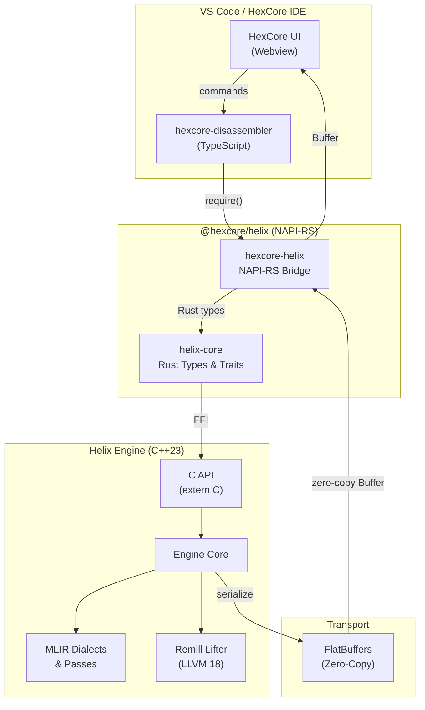

# HexCore Helix

> **Next-generation decompilation engine** — Rust + C++23/MLIR + FlatBuffers

[](https://github.com/LXrdKnowkill/HexCore-Helix/actions/workflows/build.yml)

## Architecture



## Stack

| Layer | Technology | Purpose |
|---|---|---|
| **Lifting** | Remill (LLVM 18) | Machine code → LLVM IR |
| **Core Logic** | C++23 + MLIR | Custom dialects for progressive decompilation |
| **HIR Pipeline** | Rust (helix-core) | Calling convention, type propagation, control flow recovery |
| **Safety Bridge** | Rust + NAPI-RS | Memory-safe bridge to Node.js/VS Code |
| **Transport** | FlatBuffers | Zero-copy IPC between engine and UI |

## What's Working (Feb 2026)

### HIR Pipeline (Phase 1.5) ✅

The Rust-based HIR (High-level IR) pipeline is fully operational and serves as the primary decompilation path:

- **HIR Builder & Emitter** — Lowering from Remill IR to pseudo-C with named variables, types, and indentation
- **Calling Convention Recovery** — Win64 argument folding, result naming, register elimination
- **Type Propagation** — Iterative refinement of `Unknown` types to fixed-point
- **Control Flow Structuring** — Recovery of `if/else` and `while` loops from CMP/TEST + Jcc patterns
- **Expanded Semantics** — CMOV, XCHG, MOVZX/MOVSX, BSF/BSR, BSWAP, REP MOVS/STOS, CDQE
- **Data Flow Analysis** — Liveness, reaching definitions, dead code elimination
- **Structured Diagnostics** — Typed diagnostic system (Error/Warning/Info/Hint)
- **104 unit tests passing**, throughput **>95 instr/ms** on real game binaries

### FlatBuffers Transport (Phase 3) ✅

Zero-copy binary transport between the engine and the VS Code UI:

- **Schemas** — `common.fbs`, `cfg.fbs` (file ID `HCFG`), `ast.fbs` (file ID `HAST`)
- **Rust serialization** — Manual FlatBuffer builder with roundtrip tests
- **NAPI zero-copy** — `Buffer` objects passed directly to TypeScript without copying

## Test Data — Helix vs Rellic

The `tests/` directory contains real-world decompilation outputs from **Rise of the Tomb Raider** (`ROTTR.exe`) and **World War Z** (`wwzRetailEgs.exe`), comparing the HexCore Helix output against the HexCore Rellic (experimental) output:

```
tests/
├── Remill-1/          # camera-init (wwz)
├── Remill-2/          # aim-assist-init (wwz)
├── Remill-3/          # swarm-serialization (wwz)
├── Remill-4/          # swarm-write (wwz)
├── Remill-5/          # name-writing (wwz)
├── remill-6/          # name-writing alternative
└── reports/
    ├── latest.md             # Current benchmark results
    ├── helix-vs-rellic.md    # Side-by-side comparison metrics
    └── flatbuf-vs-json.md    # FlatBuffers vs JSON benchmark
```

Each test case contains:
- `*.ll` — Remill-lifted LLVM IR
- `*.c` — Rellic decompiled output (verbose, ~62 lines with temporaries)
- `*.helix.c` — Helix decompiled output (clean, ~12 lines)

### Benchmark Highlights (ROTTR.exe)

| Sample | Functions | Instructions | Throughput | Mean |
|---|---|---|---|---|
| Sample A (calls + register moves) | 3 | 52 | 95.44 instr/ms | 0.545ms |
| Sample B (LEA + memory stores) | 6 | 48 | 79.92 instr/ms | 0.601ms |
| Sample C (branch-heavy) | 2 | 65 | 99.37 instr/ms | 0.654ms |

## Project Structure

```
HexCore-Helix/
├── Cargo.toml                 # Rust workspace root
├── package.json               # NPM package (@hexcore/helix)
├── index.js                   # Native binary auto-loader
├── index.d.ts                 # TypeScript declarations
├── crates/
│   ├── helix-core/            # Pure Rust library (types, traits, FFI)
│   │   └── src/
│   │       ├── lib.rs         # Module root
│   │       ├── types.rs       # Address, Instruction, CFG, etc.
│   │       ├── ir/            # HIR pipeline (parser, builder, emitter)
│   │       ├── analysis/      # Data flow, control flow, calling convention
│   │       ├── flatbuf/       # FlatBuffer serialization (CFG, AST)
│   │       ├── pipeline.rs    # Lifter/TransformPass/Emitter traits
│   │       ├── ffi.rs         # C++ FFI boundary
│   │       └── error.rs       # Error types
│   └── hexcore-helix/         # NAPI-RS bridge (Node.js ↔ Rust)
│       └── src/
│           ├── lib.rs         # Module root
│           ├── engine.rs      # HelixEngine JS class
│           └── transport.rs   # FlatBuffer zero-copy transport
├── engine/                    # C++23 engine (Phase 2 — WIP)
│   ├── CMakeLists.txt         # CMake build (C++23, LLVM/MLIR)
│   ├── include/helix/
│   │   ├── Engine.h           # Engine class + C API
│   │   └── Types.h            # FFI-safe types
│   └── src/
│       ├── Engine.cpp         # Engine implementation
│       └── CApi.cpp           # C API bridge
├── schemas/                   # FlatBuffers schemas
│   ├── common.fbs             # Shared types (Address, Instruction, Arch)
│   ├── cfg.fbs                # Control Flow Graph
│   └── ast.fbs                # Abstract Syntax Tree
├── tests/                     # Real-world test cases (ROTTR, WWZ)
│   ├── Remill-*/              # IR + Rellic + Helix outputs
│   └── reports/               # Benchmark and comparison reports
└── .github/workflows/
    └── build.yml              # CI/CD pipeline
```

## Quick Start

### Prerequisites

- **Rust** (stable, via `rustup`)
- **Node.js** ≥ 22
- **CMake** ≥ 3.20
- **C++23 compiler** (MSVC 2022, GCC 13+, or Clang 16+)

### Foundation Baseline (2026)

- **Node runtime policy**: Node 22+ only (avoid EOL runtime drift).
- **NAPI-RS**: `napi` 3.x + `napi-derive` 3.x.
- **Transport**: FlatBuffers 25.x runtime.
- **ABI guardrails**: `helix-core` includes explicit contract tests for `ArchKind` and `HelixStatus`.

### Build

```bash
# Install npm dependencies
npm install

# Build C++ engine (optional — Phase 2 WIP)
cmake -B engine/build -S engine -DCMAKE_BUILD_TYPE=Release
cmake --build engine/build --config Release

# Build NAPI-RS native module
npm run build

# Run Rust tests
cargo test --workspace

# Verify Rust code
cargo check --workspace
cargo clippy --workspace
```

### Optional: Signature DB (CRT/Win32 naming)

Helix can rename recovered call targets from a CSV address database:

```csv
# signatures/windows_crt_win32.csv
0x140123456,CreateFileW,HANDLE
0x140123500,CloseHandle,BOOL
0x140123980,memcpy,void*
```

Lookup order:
- `signatures/windows_crt_win32.csv`
- `signatures/signatures.csv`
- `signatures.csv`

### Usage (TypeScript)

```typescript
import { HelixEngine, Architecture } from '@hexcore/helix';

const engine = new HelixEngine(Architecture.X86_64);
const binary = fs.readFileSync('target.exe');

const result = engine.decompile(binary, 0x400000n, 0x401000n);
console.log(result.source);
console.log(`Blocks: ${result.blockCount}, Instructions: ${result.instructionCount}`);

engine.dispose();
```

## Roadmap

- [x] **Phase 1**: Foundation & Safety Bridge (Rust + NAPI-RS + C++ scaffold)
- [x] **Phase 1.5**: HIR Pipeline & Robustness (104 tests, >95 instr/ms)
- [ ] **Phase 2**: MLIR Engine (Custom Helix dialect, Remill ingestion, transform passes)
- [x] **Phase 3**: FlatBuffers Transport (Zero-copy CFG/AST schemas + serialization)
- [ ] **Phase 4**: HexCore IDE Integration
- [ ] **Phase 5**: Stabilization & Audit

## License

MIT — HexCore Project
